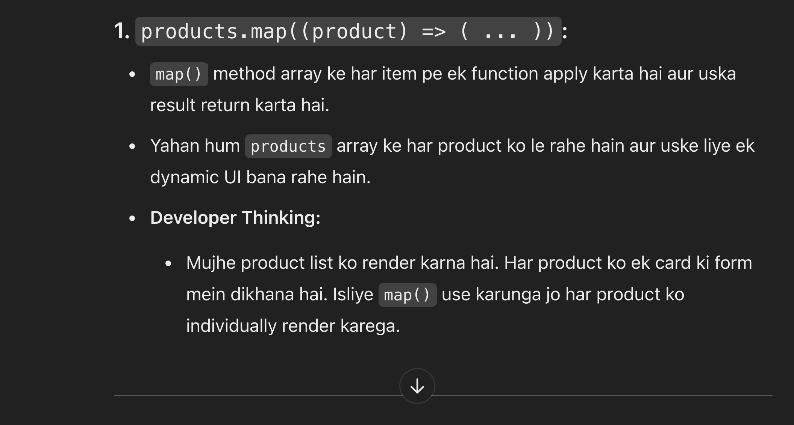
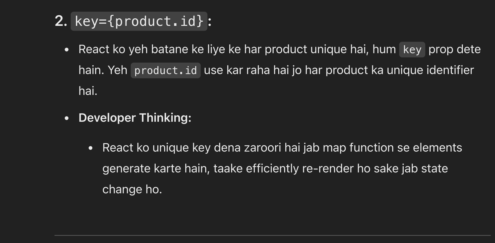
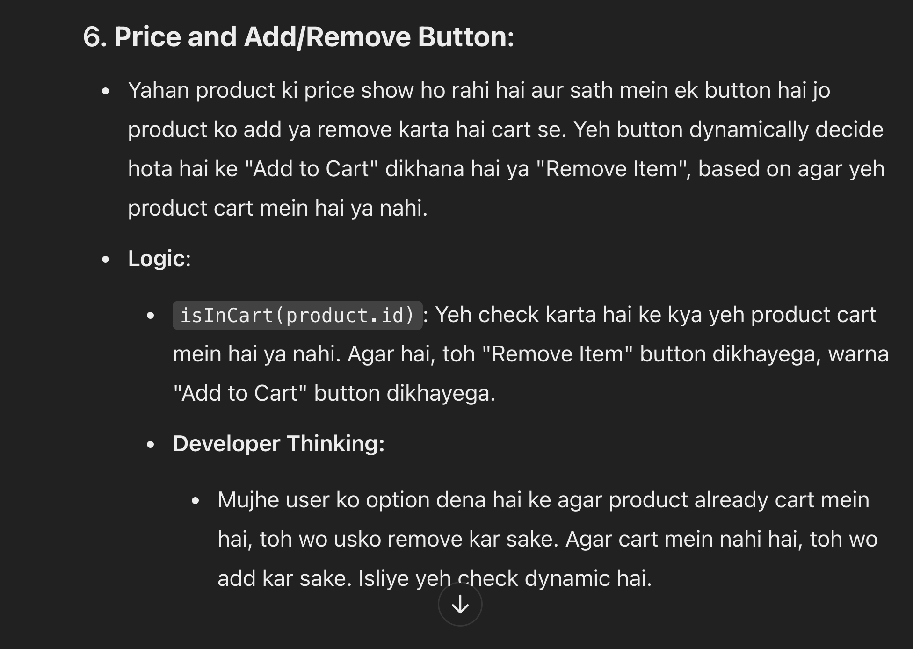
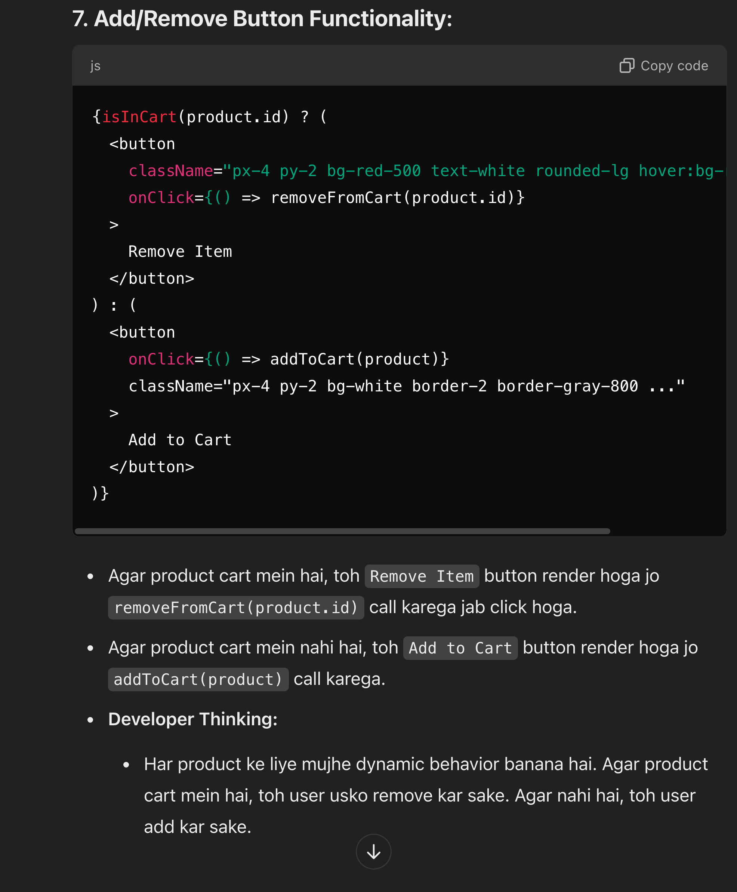

<h1 style=" color: white; border: 2px solid white; border-radius: 5px; font-size: 40px;"> <d style="background-color: green; border: 2px solid white; border-radius: 5px; padding: 8px;" >Shopping Carts Logic Part 3</d>   

<audio controls>
  <source src="./images/music.mp3" type="audio/ogg">
</audio>
<audio controls>
  <source src="./images/4.mp3" type="audio/ogg">
</audio>
 

<audio controls>
  <source src="./images/5.mp3" type="audio/ogg">
</audio>
 

<audio controls>
  <source src="./images/6.mp3" type="audio/ogg">
</audio>
 

<audio controls>
  <source src="./images/7.mp3" type="audio/ogg">
</audio>
<audio controls>
  <source src="./images/8.mp3" type="audio/ogg">
</audio>
 